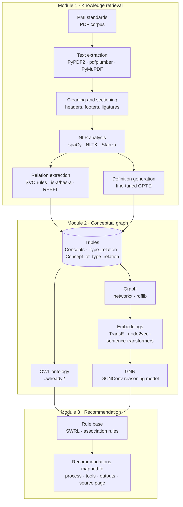

# PM Knowledge Graph — Ontology & Recommendation over PMI Standards

<p align="center">
  
  
  
  
  
  
  
  
  
  
  
  
  
  
  
  
  
</p>

Research code that turns PMI's project-management standards from human-readable
PDFs into a machine-interpretable **knowledge graph and OWL ontology**, then
learns graph embeddings over it to drive a concept recommendation engine for
project risk management.

Academic project — ESPRIT, *IA & Cognition* (5DS), 2024–2025, in collaboration
with Tenstep Tunisia.

---

## Table of contents

- [Overview](#overview)
- [Architecture](#architecture)
- [Technology stack](#technology-stack)
- [Project structure](#project-structure)
- [Pipeline — notebook order](#pipeline--notebook-order)
- [Prerequisites](#prerequisites)
- [Installation](#installation)
- [Running locally](#running-locally)
- [Reproducibility limitations](#reproducibility-limitations)
- [Configuration](#configuration)
- [Testing, build, deployment](#testing-build-deployment)
- [Project status](#project-status)
- [Corpus & licensing](#corpus--licensing)
- [Known issues & technical debt](#known-issues--technical-debt)

---

## Overview

**The problem.** Project Risk Management (PRM) is a knowledge-intensive
discipline whose body of knowledge lives in prose standards. That creates
practical obstacles: PRM terminology is not standardised, competing
best-practice frameworks overlap, and — critically — the frameworks are written
in natural language that software cannot interpret or reason over.

**The approach.** Learn the structure automatically from the standards
themselves:

1. **Knowledge retrieval** — extract concepts, definitions, synonyms and
   relations from the PMI PDFs using NLP, transformer relation-extraction and a
   fine-tuned language model.
2. **Conceptual graph construction** — organise the extracted entities into an
   OWL ontology (classes, individuals, data properties, object properties,
   axioms, SWRL rules) and an equivalent graph, then learn vector
   representations of its nodes and edges.
3. **Recommendation** — infer guidance for a practitioner's query by reasoning
   over the ontology, resolving each answer back to the process, its
   inputs/tools/outputs, and the page of the source standard.

**Main capabilities implemented in this repository**

- Section-aware PDF text extraction and cleanup for PMI standards, including
  repair of ligature damage typical of these documents (`de nes` → `defines`).
- Rule-based and dependency-parse-based relation extraction (SVO, "is a",
  "has a", compound nouns) plus REBEL neural triplet extraction.
- Concept definition generation from a GPT-2 model fine-tuned on the risk corpus.
- OWL ontology materialisation with `owlready2`, annotated per PMI process.
- Knowledge-graph embeddings via **TransE** (PyKEEN) and **node2vec**, and GNN
  training (`GCNConv`) over the resulting node/edge features.
- A keyword-driven recommendation function that maps results back to source
  pages and figures.

---

## Architecture

Three modules, matching the design in `docs/presentations/`:



**Component responsibilities**

| Component | Responsibility | Where |
|---|---|---|
| Text extraction & cleanup | Turn PDF prose into per-process sentence tables | notebooks 01, 02, 03 |
| Relation extraction | Produce `head / relation / tail` triples | notebooks 01, 02, 03 |
| Ontology | Formal, reasoner-ready representation | notebook 02 → `Ontology_PMBOKV2.0.owl` |
| Embeddings + GNN | Vector representation for similarity & inference | notebooks 04, 05 |
| Recommender | Answer a practitioner query from the ontology | notebook 02 (`Recommande()`) |

**External dependencies:** none at runtime. There is no database, no API, no
cloud service and no authentication anywhere in this project — everything runs
locally (or on Kaggle) against files on disk. Pretrained models
(`bert-base-uncased`, `gpt2-medium`, `Babelscape/rebel-large`,
`sentence-transformers/all-mpnet-base-v2`, `paraphrase-MiniLM-L6-v2`) are
downloaded from the Hugging Face Hub on first use, anonymously.

---

## Technology stack

Verified from the actual imports in `notebooks/`.

| Layer | Technologies |
|---|---|
| Language / runtime | Python 3, Jupyter notebooks |
| PDF extraction | PyPDF2, pdfplumber, PyMuPDF (`fitz`) |
| NLP | spaCy (`en_core_web_sm`), NLTK, Stanza, textacy, rake-nltk, pyspellchecker, fuzzywuzzy |
| Language models | Hugging Face Transformers (BERT, GPT-2 fine-tuning, REBEL), sentence-transformers |
| Semantic web | owlready2 (OWL + SWRL), rdflib |
| Graph | NetworkX, node2vec, gensim |
| Graph ML | PyTorch, PyTorch Geometric (`GCNConv`), PyKEEN (TransE) |
| Classical ML | scikit-learn (TF-IDF, t-SNE, cosine similarity, splits) |
| Visualisation | matplotlib, Plotly, wordcloud |
| Evaluation | PyKEEN `RankBasedEvaluator`, ROUGE |

There is **no** frontend, backend, database, container, CI or cloud component in
this repository.

---

## Project structure

```text
Knowledge Graph/
├── notebooks/                # All project code, numbered in pipeline order
│   ├── 01_risk_standard_preprocessing.ipynb
│   ├── 02_pmbok_ontology_construction.ipynb
│   ├── 03_concept_definitions_and_triplets.ipynb
│   ├── 04_graph_embeddings_transe_gnn.ipynb
│   └── 05_graph_embeddings_node2vec_gnn.ipynb
├── data/
│   ├── corpus/               # Source PMI PDFs — gitignored, see its README
│   ├── interim/              # Intermediate CSVs — gitignored
│   └── processed/            # Final datasets — gitignored
├── docs/
│   ├── architecture.md       # Component detail & data schema
│   ├── pipeline.md           # Per-notebook input/output contract
│   └── presentations/        # Project presentations (source of the design)
├── requirements.txt
├── CLAUDE.md                 # Guidance for AI coding assistants
├── .gitignore
└── README.md
```

### Filename mapping

Files were renamed during repository organisation. Nothing imports them, so no
code was affected.

| Previous name | Current path |
|---|---|
| `rm-standard.ipynb` | `notebooks/01_risk_standard_preprocessing.ipynb` |
| `projetiacognition.ipynb` | `notebooks/02_pmbok_ontology_construction.ipynb` |
| `practise-standard.ipynb` | `notebooks/03_concept_definitions_and_triplets.ipynb` |
| `knowledge-graph.ipynb` | `notebooks/04_graph_embeddings_transe_gnn.ipynb` |
| `graph-2.ipynb` | `notebooks/05_graph_embeddings_node2vec_gnn.ipynb` |
| `PROJECT1.pptx` | `docs/presentations/2024_pm_knowledge_graph_tenstep.pptx` |
| `PROJECT2.pptx` | `docs/presentations/2024_prm_recommender_esprit.pptx` |
| `PMBOK 7th Edition (iBIMOne.com).pdf` | `data/corpus/PMBOK-7th-Edition.pdf` (gitignored) |
| `practice-standard-project-risk-management.pdf` | `data/corpus/practice-standard-project-risk-management.pdf` (gitignored) |

---

## Pipeline — notebook order

The notebooks form a chain: each consumes artifacts the previous one produced.
`docs/pipeline.md` documents the full input/output contract.

| # | Notebook | Reads | Produces |
|---|---|---|---|
| 01 | `01_risk_standard_preprocessing.ipynb` | Practice Standard for Project Risk Management PDF | Per-process sentence DataFrames, grammatical & semantic relations, frequent-concept counts |
| 02 | `02_pmbok_ontology_construction.ipynb` | PMBOK PDF *(6th Ed. — see version note)*, risk standard PDF | `Ontology_PMBOKV2.0.owl`, process annotations, `Recommande()` retrieval |
| 03 | `03_concept_definitions_and_triplets.ipynb` | Risk standard PDF, glossary PDF, `definitions.csv`, `first_version.csv` | Fine-tuned GPT-2 definitions, REBEL triplets → `htt.csv`, `data_final_pmi.csv` |
| 04 | `04_graph_embeddings_transe_gnn.ipynb` | `Concat.csv` | TransE embeddings, `DeepReasoningGNN`, `graph_data.graphml`, `deep_reasoning_gnn_model.pth` |
| 05 | `05_graph_embeddings_node2vec_gnn.ipynb` | `finalDF (1).csv` | node2vec node/edge embeddings, 3-D Plotly graph, 2-layer GCN |

**04 and 05 are alternative embedding approaches over the same triples, not
successive steps.** 04 uses knowledge-graph embeddings (TransE) as node features;
05 uses node2vec structural embeddings plus sentence-transformer text
embeddings. Both are retained deliberately.

### Canonical data schema

Every stage carries the same triple schema in CSV form:

| Column | Meaning |
|---|---|
| `Concepts` | Head entity — a graph node |
| `Type_relation` | Relation — the graph edge label |
| `Concept_of_type_relation` | Tail entity — a graph node |
| `Definition` | Concept definition (also used as a node text feature) |
| `Synonym` | Alternative surface forms |
| `Reference` | Source location in the standard |
| `Process_name` | Owning PMI process |

---

## Prerequisites

- **Python 3.9+** with `pip` and `venv`
- **Jupyter** (JupyterLab is included in `requirements.txt`)
- **~10 GB free disk** for pretrained model downloads and caches
- **A CUDA GPU is strongly recommended.** Notebook 03 fine-tunes `gpt2-medium`
  for 500 epochs and notebook 04 trains TransE for 100 epochs plus a 4-layer
  GNN; these are impractical on CPU.
- **Your own copies of the two PMI standards** — see
  [`data/corpus/README.md`](data/corpus/README.md)

---

## Installation

```bash
# 1. Create and activate a virtual environment
python -m venv .venv
# Windows (PowerShell)
.venv\Scripts\Activate.ps1
# macOS / Linux
source .venv/bin/activate

# 2. Install PyTorch first, matched to your CUDA version
#    https://pytorch.org/get-started/locally/
pip install torch

# 3. Install the remaining dependencies
pip install -r requirements.txt

# 4. Download the spaCy model
python -m spacy download en_core_web_sm

# 5. Download the NLTK corpora used by notebooks 01 and 02
python -c "import nltk; [nltk.download(p) for p in ['stopwords','punkt','wordnet','averaged_perceptron_tagger','omw-1.4']]"
```

Stanza (used in notebook 03) downloads its English model on first use via
`stanza.download('en')`, which the notebook already calls.

> **Version warning.** `requirements.txt` is intentionally unpinned — the
> notebooks ran on Kaggle's managed image and no lockfile was ever produced, so
> no exact version set can be claimed as verified. Expect to resolve API drift,
> particularly in `transformers` and `torch-geometric`.

---

## Running locally

```bash
jupyter lab
```

Then open `notebooks/` and run the notebooks in numeric order.

### You must rewrite the Kaggle paths first

Every notebook was written on Kaggle and reads and writes **absolute
`/kaggle/...` paths that do not exist on a local machine.** Before running any
notebook, replace them with paths under `data/`:

| Hardcoded path in the notebooks | Local equivalent |
|---|---|
| `/kaggle/input/rm-practise/practice-standard-project-risk-management.pdf` | `data/corpus/practice-standard-project-risk-management.pdf` |
| `/kaggle/input/pmi-practise/practice-standard-project-risk-management.pdf` | `data/corpus/practice-standard-project-risk-management.pdf` |
| `/kaggle/input/pmi-practice-standard-project-risk-management/…` | `data/corpus/practice-standard-project-risk-management.pdf` |
| `/kaggle/input/pmbok6/PMBOK6-2017.pdf` | `data/corpus/` — **6th Edition required**, see the corpus README |
| `/kaggle/input/glossary/Glossary_Of_Risk_Management.pdf` | not available — see below |
| `/kaggle/input/definitions-pmi/definitions.csv` | not available — see below |
| `/kaggle/input/first-version/first_version.csv` | not available — see below |
| `/kaggle/input/triplets-dataset/htt.csv` | not available — see below |
| `/kaggle/input/head-type-tail/head_type_tail.csv` | not available — see below |
| `/kaggle/input/concat/Concat.csv` | not available — see below |
| `/kaggle/input/final-dataset/finalDF (1).csv` | not available — see below |
| `/kaggle/working/…` (all writes) | `data/processed/` or `data/interim/` |

The notebooks also contain Linux-only shell cells (`!unzip …`, `!pip install …`)
that need adapting on Windows.

---

## Reproducibility limitations

Read this before assuming a notebook will run end to end.

1. **The intermediate datasets are missing.** `Concat.csv`, `finalDF (1).csv`,
   `definitions.csv`, `htt.csv`, `head_type_tail.csv`, `first_version.csv` and
   `Glossary_Of_Risk_Management.pdf` existed only as private Kaggle datasets and
   are not archived here. Notebooks 04 and 05 **cannot run** until their input
   CSV is regenerated by the earlier notebooks or restored from Kaggle.
2. **The corpus PDFs are not distributed** (copyright) — supply your own.
3. **PMBOK version mismatch** — notebook 02 targets the 6th Edition; the PDF
   that accompanied this project is the 7th. Section extraction is
   numbering-sensitive.
4. **No pinned versions**, so an identical environment cannot be reconstructed.
5. **Committed cell outputs** in the notebooks reflect the original Kaggle runs
   and are the only surviving record of those results — do not clear them
   casually.
6. **Seeds are partial.** `torch.manual_seed(0)` and `random_state=42` appear in
   places, but not across the whole pipeline, so exact numeric reproduction is
   not guaranteed even with identical inputs.

---

## Configuration

**This project has no configuration layer.** There are no environment
variables, no `.env` file, no config files, no secrets and no credentials of any
kind — every setting is a literal inside a notebook cell. Consequently there is
no `.env.example` to provide.

The values that behave like configuration, and where to change them:

| Setting | Value | Location |
|---|---|---|
| Corpus page ranges | e.g. pages 12–67, 431–494 | notebooks 01, 03 |
| Section split markers | `"1.1"`, `"2.1"` … `"A.1"` | notebook 01 |
| TransE embedding dim / epochs | 64 / 100 | notebook 04 |
| GNN hidden dim / layers / dropout | 128 / 4 / 0.5 | notebook 04 |
| node2vec dims / walk length / walks | 64 / 30 / 200 | notebook 05 |
| Sentence-transformer model | `paraphrase-MiniLM-L6-v2` (384-d) | notebook 05 |
| GPT-2 fine-tuning epochs / batch | 500 / 16 | notebook 03 |

### Environment separation

Not applicable. There are no development, test, staging or production
environments — this is a single-environment research project.

---

## Testing, build, deployment

**None of these exist in this repository, and none are documented here rather
than invented:**

- **Tests** — there is no test suite, no test framework and no test command.
- **Linting / formatting / type checking** — no tooling is configured.
- **Build** — nothing is built. There is no package, `setup.py`,
  `pyproject.toml` or distributable artifact; the notebooks are run directly.
- **Deployment** — there is no Dockerfile, Compose file, CI/CD pipeline,
  infrastructure-as-code, or cloud configuration. Nothing in this repository is
  deployed anywhere.

Validation today is manual: run a notebook and inspect its outputs.

---

## Project status

**Implemented and present here**

- ✅ Knowledge retrieval from the PMI risk standard and PMBOK (notebooks 01–03)
- ✅ OWL ontology construction with process annotations (notebook 02)
- ✅ Rule-based recommendation function with source-page resolution (notebook 02)
- ✅ Knowledge-graph embeddings and GNN training (notebooks 04–05)

**Described in the project presentations but NOT present in this repository**

- ❌ **The web application.** The presentations state the final deliverable as a
  web application serving real-time personalised recommendations. No frontend,
  backend, API or server code exists here. The recommendation logic exists only
  as notebook functions.
- ❌ Expert-based system evaluation.

The ontology statistics quoted in the presentations — 1,492 concepts, 360 object
properties, 66 instances, 90 data properties, 187 axioms, 22 SWRL rules — are
reported there as results; the `.owl` artifact itself is not committed (it is
regenerated by notebook 02).

---

## Corpus & licensing

The PMI standards under `data/corpus/` are **third-party copyrighted
publications** and are excluded from version control. They are not
redistributed by this repository. Obtain them from PMI or an institutional
subscription — see [`data/corpus/README.md`](data/corpus/README.md).

**No licence has been chosen for this repository's own code.** This is academic
work produced in an ESPRIT course in collaboration with Tenstep Tunisia, and the
ownership terms are not recorded anywhere in the repository. Until a `LICENSE`
file is added, default copyright applies and the code carries no grant of use.

---

## Known issues & technical debt

Recorded from an audit of the notebooks; none have been "fixed", because doing
so would change research code.

- **Duplicated helpers.** `preprocess_text`, `extract_text`,
  `correct_extraction_mistakes` and the relation extractors are redefined in
  several notebooks with divergent behaviour. Changing one does not change the
  others.
- **Self-conflicting install.** Notebook 03 installs `transformers==4.12.0` then
  immediately reinstalls `transformers` unpinned in the same cell.
- **O(n²) index lookups.** `list(G.nodes()).index(...)` inside per-row loops
  (notebooks 04, 05) makes graph node insertion order load-bearing — reordering
  graph construction silently corrupts the edge indices.
- **Placeholder training targets.** Notebook 04 trains `DeepReasoningGNN`
  against `torch.rand(...)` tensors standing in for definition/synonym/relation
  targets, so its reported loss does not measure a real learning objective.
- **Debug output in a hot path.** `GNN.forward()` in notebook 05 calls `print(x)`
  on every forward pass.
- **Mixed-language documentation.** Markdown cells and comments mix French and
  English.
- **Commented-out code blocks** remain in notebooks 01 and 03 (e.g. the disabled
  `correct_extraction_mistakes` batch in 01).
