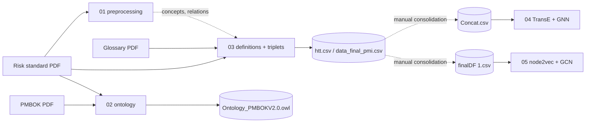

# Pipeline — per-notebook input/output contract

What each notebook reads, what it produces, and what breaks if you run it as-is.
Paths shown as `/kaggle/...` are the literals still present in the notebook
cells; see the rewrite table in the root [`README.md`](../README.md).

The dotted edges are the weak links: the consolidation from notebook 03's output
into `Concat.csv` and `finalDF (1).csv` was **done outside the notebooks**, on
Kaggle, and is not recorded anywhere in this repository.

---

## 01 — `01_risk_standard_preprocessing.ipynb`

*(was `rm-standard.ipynb`, 104 cells)*

| | |
|---|---|
| **Reads** | `/kaggle/input/rm-practise/practice-standard-project-risk-management.pdf` |
| **Writes** | Nothing to disk — all results stay in in-memory DataFrames |
| **Runs standalone?** | ✅ Yes, once the PDF path is fixed |

**Flow:** PyPDF2 full-text extraction → `remove_section` for TOC and list of
figures → nine per-process slices via `extract_text` → subsection-title removal
→ `preprocess_text` cleanup → NLTK sentence tokenisation → one DataFrame per
process (`df_intro`, `df_pcc`, `df_prm`, `df_ir`, `df_pqra`, `df_pqraa`,
`df_prr`, `df_mcr`) → per-sentence `gram_relations` and `sem_relations` columns
→ `calculate_frequent_concepts()` frequency ranking → TF-IDF (gensim/sklearn).

**Notes**
- Cell 25 runs `!unzip` against `/usr/share/nltk_data` — a Kaggle-specific fix
  for a corrupt WordNet archive. Skip it locally.
- Cell 21 is a fully commented-out block applying `correct_extraction_mistakes`
  before the function is defined at cell 41; the live application happens at
  cell 43.

---

## 02 — `02_pmbok_ontology_construction.ipynb`

*(was `projetiacognition.ipynb`, 330 cells — the largest notebook and the
ontology core)*

| | |
|---|---|
| **Reads** | `/kaggle/input/pmbok6/PMBOK6-2017.pdf`, `/kaggle/input/pmi-practice-standard-project-risk-management/practice-standard-project-risk-management.pdf` |
| **Writes** | `/kaggle/working/Ontology_PMBOKV2.0.owl`, `/kaggle/working/PROJECT_RISK_MANAGEMENT.pdf` |
| **Runs standalone?** | ⚠️ Only with the **PMBOK 6th Edition** — the on-disk PDF is the 7th |

**Phases**, as labelled by the notebook's own markdown headings:

1. **Phase 1 — Preprocessing.** Same cleanup family as notebook 01, applied to
   PMBOK; per-process extraction for the seven PMI risk processes (Plan Risk
   Management through Monitor Risks); sentence tokenisation, lemmatisation,
   synonym lookup via WordNet, word tokenisation, wordcloud visualisation, NER
   over both PMBOK and the PMI standard.
2. **Phase 2 — Title extraction and rules.** Synonym matching across both
   sources; rule extraction — subject-predicate-object with compound nouns, and
   the "is a / have a" rule; outlier removal; NLTK chunking; TF-IDF retrieval
   evaluation.
3. **Phase 4 — OWL extraction.** Entity organisation into concepts /
   individuals / properties / attributes, then `owlready2` materialisation:
   classes and subclasses, data properties, object properties, individuals, and
   save.
4. **Annotations.** Per-process annotation, then inputs / outputs / tools-and-
   techniques annotation for each of the six risk processes.
5. **Recommendation system.** Keyword extraction (RAKE) and the `Recommande()`
   family of functions, including figure- and section-to-page resolution.

**Notes**
- There is no "Phase 3" heading in the notebook; the numbering jumps from 2 to 4.
- The recommender's page resolution hardcodes PMBOK page offsets
  (`+26`, ranges `[27,130]`, `[130,252]`, `[253,380]`, `[381,500]`), which are
  6th-Edition pagination.

---

## 03 — `03_concept_definitions_and_triplets.ipynb`

*(was `practise-standard.ipynb`, 167 cells)*

| | |
|---|---|
| **Reads** | `/kaggle/input/pmi-practise/practice-standard-project-risk-management.pdf` (pages 12–67), `/kaggle/input/glossary/Glossary_Of_Risk_Management.pdf`, `/kaggle/input/definitions-pmi/definitions.csv`, `/kaggle/input/first-version/first_version.csv`, `/kaggle/input/triplets-dataset/htt.csv`, `/kaggle/input/head-type-tail/head_type_tail.csv` |
| **Writes** | `output.txt` (GPT-2 training corpus), `fine_tuned_model.pt`, `/kaggle/working/definitions.csv`, `/kaggle/working/htt.csv`, `/kaggle/working/data_final_pmi.csv` |
| **Runs standalone?** | ❌ No — four of its inputs are missing Kaggle datasets |

**Flow:** BERT-assisted title/description extraction → corpus extraction with
pdfplumber → GPT-2 `gpt2-medium` fine-tuning (500 epochs, batch 16) → per-concept
definition generation → DataFrame assembly with the canonical columns →
`Type_relation` extraction from text after a colon → definition attachment with
normalised (lowercased, special-characters-stripped) concept matching →
"described in section" extraction → REBEL triplet extraction wrapped in the `KB`
deduplication class → triplet DataFrame export.

**Notes**
- The install cell pins `transformers==4.12.0` and then reinstalls
  `transformers` unpinned two lines later. The unpinned install wins.
- Uses the deprecated `TextDataset` / `DataCollatorForLanguageModeling` API,
  which was removed in recent `transformers` releases.
- ROUGE is imported for evaluation of the generated definitions.

---

## 04 — `04_graph_embeddings_transe_gnn.ipynb`

*(was `knowledge-graph.ipynb`)*

| | |
|---|---|
| **Reads** | `/kaggle/input/concat/Concat.csv` |
| **Writes** | `/kaggle/working/graph_data.graphml`, `/kaggle/working/deep_reasoning_gnn_model.pth` |
| **Runs standalone?** | ❌ No — `Concat.csv` is not in this repository |

**Flow:** CSV → `(head, relation, tail)` triples with null filtering → `nx.DiGraph`
carrying `definition` / `synonym` / `reference` / `process` node attributes →
graph property report (directed, connectivity, density, degree stats) →
`TriplesFactory` → 80/10/10 split → **TransE** (`embedding_dim=64`, Adam, 100
epochs) → `RankBasedEvaluator` with filtered ranking → t-SNE 2-D and raw 3-D
embedding plots → entity embeddings attached as node features →
`from_networkx()` → `DeepReasoningGNN` training → GraphML and state-dict export
→ inference via `sentence-transformers/all-mpnet-base-v2` embeddings projected
768 → 64 and ranked by cosine similarity.

**Caveat:** the GNN's three training targets are `torch.rand(...)` placeholders,
so the reported loss does not correspond to a real learning objective. The
`projection_layer` used at inference is randomly initialised and never trained,
so query embeddings are not in the same space as the TransE entity embeddings.

---

## 05 — `05_graph_embeddings_node2vec_gnn.ipynb`

*(was `graph-2.ipynb`)*

| | |
|---|---|
| **Reads** | `/kaggle/input/final-dataset/finalDF (1).csv` |
| **Writes** | `node2vec.model` |
| **Runs standalone?** | ❌ No — `finalDF (1).csv` is not in this repository |

**Flow:** CSV → `rdflib` RDF graph → `nx.DiGraph` → 3-D spring layout →
interactive Plotly graph with definition / synonym / process hover labels →
**node2vec** (dim 64, walk length 30, 200 walks, p=q=1, 4 workers) → node
embeddings for head and tail → edge embeddings via `get_edge_embedding(...,
method='weighted_l2')` → sentence-transformer embeddings of `Definition` and
`Process_name` (384-d) as node features → `torch_geometric.data.Data` with
`x`, `edge_index`, `edge_attr`, `y` → 2-layer `GCNConv` (384 → 384 → 153)
trained 200 epochs with cross-entropy.

**Caveat:** `GNN.__init__` accepts `in_channels` / `hidden_channels` /
`out_channels` but ignores them — the layer sizes are hardcoded to 384 and 153.
`forward()` also prints the full output tensor on every pass.

---

## Regenerating the missing datasets

`Concat.csv` and `finalDF (1).csv` are consolidations of notebook 03's
`data_final_pmi.csv` / `htt.csv` outputs, carrying the canonical seven columns.
Neither the consolidation code nor the files survive. To restore the pipeline
end-to-end you would need to either:

1. recover the original Kaggle datasets from the account that ran them, or
2. re-run notebooks 01–03 and re-derive a combined CSV with the columns
   `Concepts`, `Type_relation`, `Concept_of_type_relation`, `Definition`,
   `Synonym`, `Reference`, `Process_name`.

Option 2 will not reproduce the committed outputs exactly — the corpus edition,
model versions and unseeded stages all differ.
